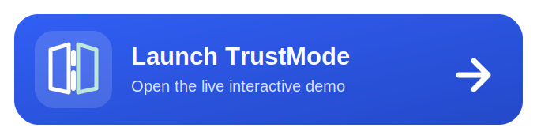
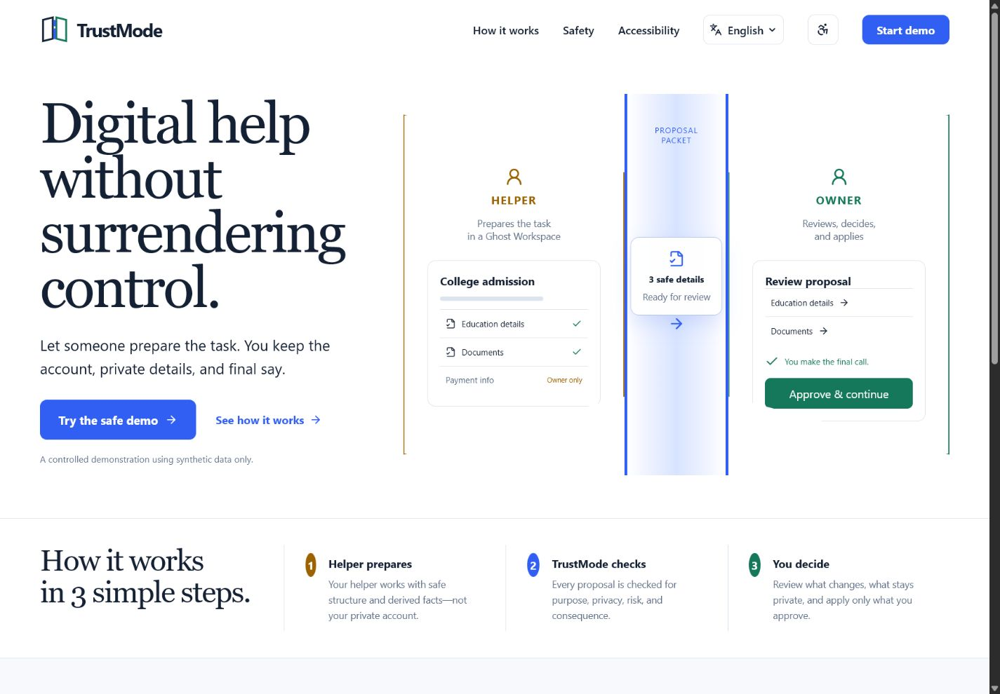
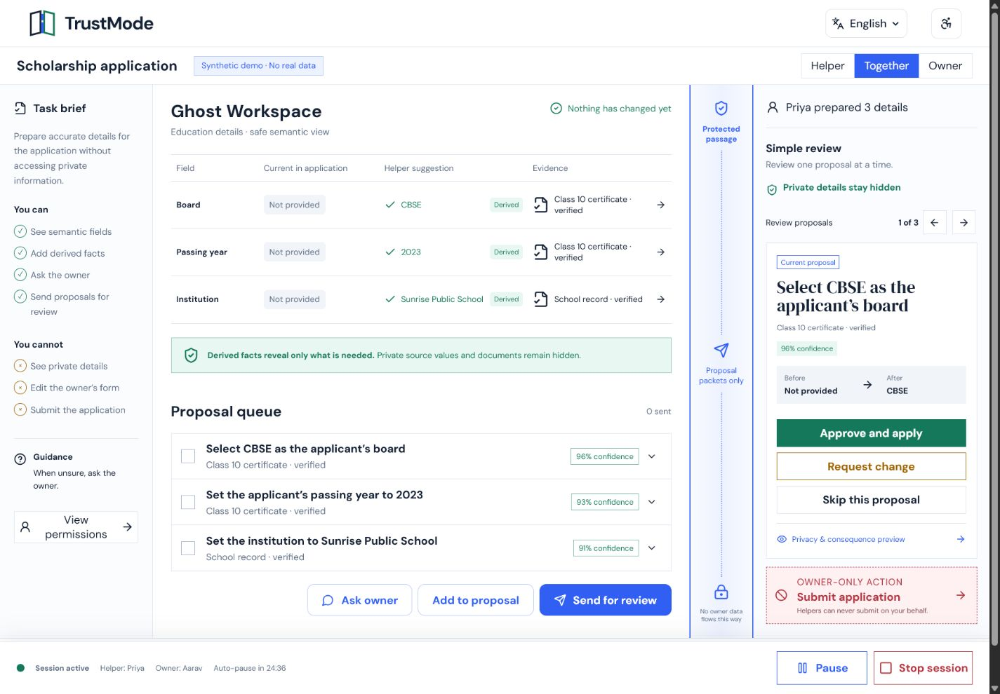
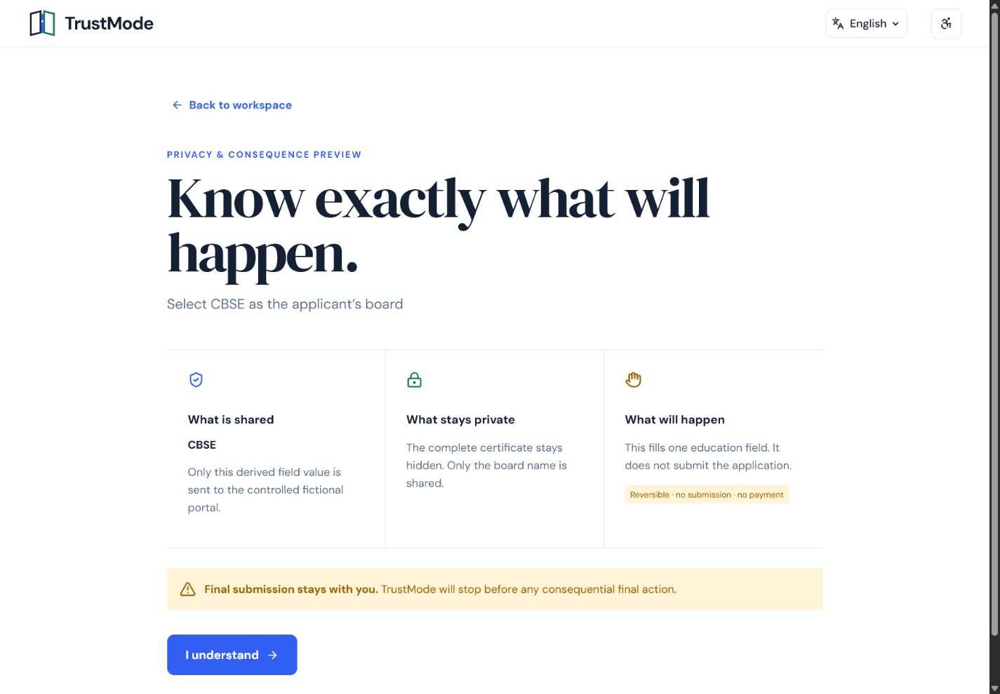
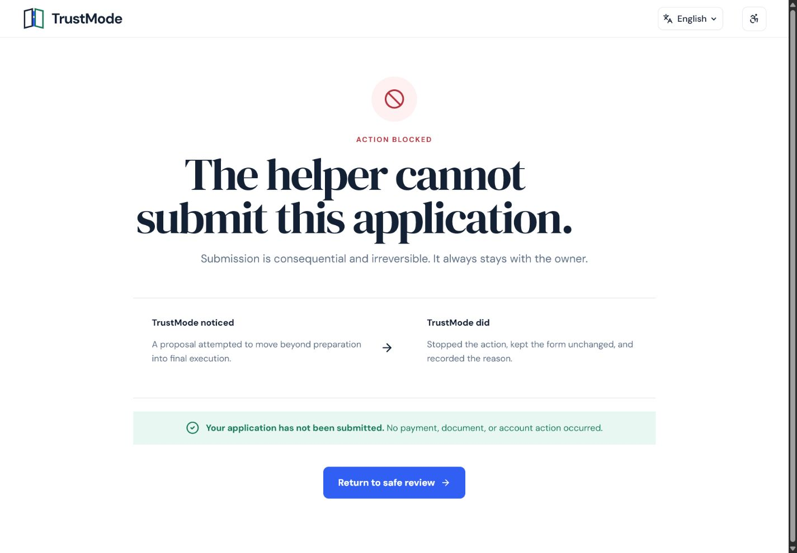
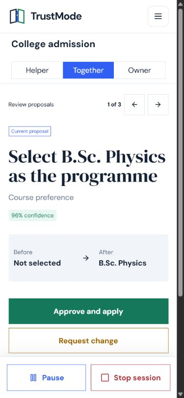
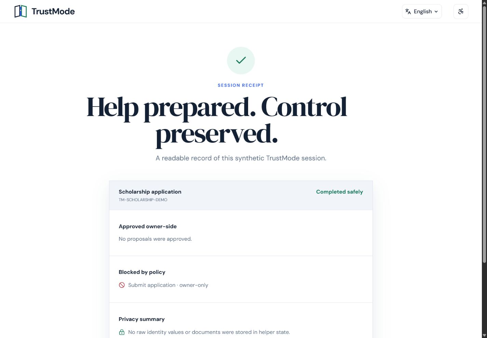
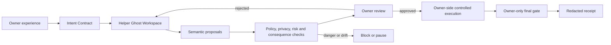

<p align="center">
  
</p>

<h1 align="center">TrustMode</h1>

<p align="center">
  <strong>Digital help without surrendering control.</strong>
</p>

<p align="center">
  A proposal-based digital-assistance system where a helper prepares a task,
  while the owner keeps the account, private data, authority, and final execution.
</p>

<p align="center">
  <a href="https://trustmode-v2.vercel.app">
    
  </a>
</p>

<p align="center">
  <strong>Live application:</strong>
  <a href="https://trustmode-v2.vercel.app">https://trustmode-v2.vercel.app</a>
</p>

<p align="center">
  <a href="https://github.com/SatyajitBeura2468/Trustmode-v2/actions/workflows/ci.yml"></a>
  
  
  
  
</p>

<p align="center">
  <a href="https://trustmode-v2.vercel.app">
    
  </a>
</p>

## Live product

The public v2 product is a real, interactive, secret-free controlled collaboration system. Choose a fictional scholarship, hospital-registration, or college-admission workflow; create an enforceable Intent Contract; issue an expiring helper capability; collaborate across tabs; prepare semantic proposals; run six fail-closed policy checks; review privacy and consequences; apply approved changes owner-side; stop and revoke the session; and export an integrity-linked receipt.

**Launch:** [trustmode-v2.vercel.app](https://trustmode-v2.vercel.app)

> TrustMode v2 is a functional controlled product using synthetic workflows. It deliberately makes no real submission, payment, account, identity, or medical-record change.

## Why TrustMode exists

People often need digital help but should not have to hand over their password, OTP, private document, authenticated browser session, payment details, or final authority. TrustMode separates **preparation** from **execution**.

The helper works inside a sanitised Ghost Workspace and prepares meaning-based proposals such as:

> Select CBSE as the applicant’s board.

The owner sees what will change, the evidence used, what stays private, the consequence, and whether the action is reversible. Only the owner side can apply an approved proposal. Consequential actions remain owner-only.

## What makes it different

| TrustMode boundary | What it means |
| --- | --- |
| Proposal, not remote control | The helper cannot directly operate the owner’s live account. |
| Ghost Workspace | The helper sees structure, placeholders, validation, and derived facts—not raw private values. |
| Semantic actions | Proposals describe meaning, evidence, target, risk, and consequence instead of screen coordinates. |
| Owner-side execution | Approved changes are validated and applied only in the owner environment. |
| Purpose-bound privacy | A derived fact can be shared without disclosing the source document. |
| Sequence-aware policy | A group of individually plausible actions can still be blocked as a dangerous path. |
| Owner-only final gate | Submission, payment, recovery, passwords, OTPs, and irreversible decisions never transfer to a helper. |
| Expiring capability | The helper receives a purpose-bound token plus a separate six-digit verification code, never the owner session. |
| Integrity-linked history | Every lifecycle event is revisioned and chained into a sanitised, downloadable receipt. |

## Product tour

### Helper Ghost Workspace

The helper can prepare semantic values, cite synthetic evidence, express confidence, ask the owner, and queue proposals. The protected passage carries proposal packets only.



### Owner review

The owner receives one understandable decision at a time, with before/after values and persistent Pause and Stop controls.


### Privacy and consequence preview



### Dangerous actions stop at the boundary



### Mobile is a first-class owner interface

<p align="center">
  
</p>

### Readable receipt



## Interactive scenarios

- **Scholarship application** — education details, eligibility facts, and document-type proposals.
- **Hospital registration** — department, visit type, and language-support preparation without exposing medical records.
- **College admission** — programme, qualifying board, and hostel preference without sharing raw certificates.

All people, services, facts, records, and submissions are fictional.

## Accessibility and language

The core journey supports English, Hindi, and Odia. The implementation includes semantic landmarks, visible focus, keyboard navigation, 44px+ controls, live state language, high contrast, larger text, Calm Mode, reduced-motion support, non-colour status cues, readable errors, and one-decision-at-a-time mobile review. Automated axe checks currently report no serious or critical violations on core desktop routes.

## Architecture



`@trustmode/core` owns the pure session state machine, typed commands, expiring capabilities, proposal lifecycle, action semantics, six-check fail-closed policy, redaction, integrity events, controlled portal state, and receipts. The deployed product stores a versioned synthetic snapshot in browser storage and synchronises same-browser tabs with `BroadcastChannel` plus storage-event fallback. It needs no secret, paid API, or database.

## Repository structure

```text
apps/
├── web-demo/       Public integrated Vite + React controlled product
├── helper/         Standalone helper Ghost Workspace
├── demo-portals/   Three controlled fictional service portals
└── extension/      Chrome Manifest V3 owner-side controlled portal adapter
packages/
└── core/           Session machine, capabilities, protocol, policy and receipts
docs/               Product, architecture, UX, visual, privacy and threat-model docs
tests/e2e/          Desktop/mobile Playwright journeys and accessibility checks
assets/readme/      Custom brand assets and production-origin screenshots
```

## Local development

Requirements: Node.js 22+ and pnpm 10.13.1.

```bash
git clone https://github.com/SatyajitBeura2468/Trustmode-v2.git
cd Trustmode-v2
pnpm install --frozen-lockfile
pnpm dev
```

The public product opens at `http://localhost:5173` with the standard dev command. The automated browser suite uses isolated port `4390`.

Run the companion surfaces:

```bash
pnpm dev:web       # integrated public demo
pnpm dev:helper    # helper workspace on port 4174
pnpm dev:portals   # controlled portals on port 4175
```

## Load the extension

```bash
pnpm --filter @trustmode/extension build
```

1. Open `chrome://extensions`.
2. Enable **Developer mode**.
3. Choose **Load unpacked**.
4. Select `apps/extension/dist`.
5. Run the integrated product with `pnpm dev:web`.
6. Open a controlled route such as `http://127.0.0.1:4390/portal/scholarship`, select the TrustMode toolbar action, and open the side panel.

The extension requests only `sidePanel`, `storage`, `activeTab`, and `scripting`, with host access restricted to the production and local TrustMode controlled portal routes. It uses no remote executable code, `eval`, browsing-history access, or unrelated-tab permission.

## Testing and production build

```bash
pnpm typecheck
pnpm lint
pnpm test
pnpm build
pnpm exec playwright install chromium
pnpm test:e2e
```

To smoke-test the deployed origin:

```bash
PLAYWRIGHT_BASE_URL=https://trustmode-v2.vercel.app pnpm test:e2e
```

The production deployment uses the root `vercel.json`, installs the workspace with the frozen lockfile, builds only `@trustmode/web-demo`, disables source maps, and rewrites direct SPA routes to `index.html`.

## Safety and privacy model

- Synthetic data only in the public demo.
- Raw identity values, private documents, credentials, OTPs, medical details, bank values, and payments do not enter helper state.
- Action targets and intents are allowlisted.
- Password, recovery, payment, arbitrary navigation, and submission proposals are blocked.
- Emergency stop revokes the invitation and every pending proposal.
- The receipt records approved, rejected, and blocked semantics without private source values.
- No analytics, heatmaps, tracking scripts, or session recording.

See [Architecture](./docs/ARCHITECTURE.md), [Action protocol](./docs/ACTION_PROTOCOL.md), [Privacy model](./docs/PRIVACY_MODEL.md), [Threat model](./docs/THREAT_MODEL.md), and [Accessibility](./docs/ACCESSIBILITY.md).

## Current limitations

TrustMode currently supports controlled fictional workflows, not arbitrary sites or real sensitive accounts. It does not process OTPs, payments, biometrics, legally binding signatures, medical-record modifications, government submissions, or account recovery. Same-browser synchronisation is not an internet collaboration backend. A future real-world release would require authenticated multi-device transport and independent security, privacy, accessibility, legal, and human-factors review.

## Project status

Controlled product v2: complete session engine, expiring helper capability, dedicated helper workspace, owner review and application, controlled portals, owner extension, fail-closed policy package, integrity receipts, responsive interfaces, documentation, CI, automated tests, and public Vercel deployment.

## Copyright

Copyright © 2026 Satyajit Beura. All rights reserved. No open-source licence is granted.
