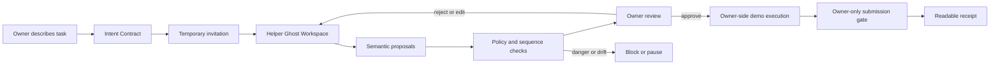

# UX flow

```mermaid
flowchart LR
  A[Owner describes task] --> B[Intent Contract]
  B --> C[Temporary invitation]
  C --> D[Helper Ghost Workspace]
  D --> E[Semantic proposals]
  E --> F[Policy and sequence checks]
  F --> G[Owner review]
  G -->|approve| H[Owner-side demo execution]
  G -->|reject or edit| D
  H --> I[Owner-only submission gate]
  I --> J[Readable receipt]
  F -->|danger or drift| K[Block or pause]
```

No helper interaction writes directly to owner state. Emergency stop revokes the session and invalidates queued proposals.
